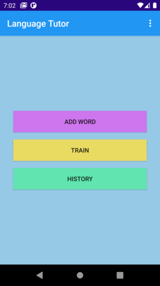
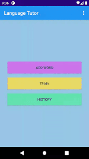
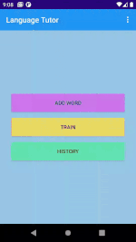
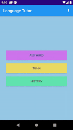
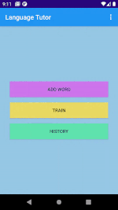

# Language Tutor

An android application in aiding you to memorize words. You have the full freedom to add your own set of vocabulary to the database, and then train with those words. You can also set practice-alarm to be reminded to come train!

##### Tech stack:

* Java
* Gradle
* Dagger2: for dependency injection
* RxJava: for retrieving data from database on background thread
* View Binding
* Room persistence library
* MVP architecture

## Getting Started
These instructions will get you a copy of the project up and running on your local machine for development and testing purposes.

#### Prerequisites

* Clone repo and open it in Android Studio
* To run project create an Emulator with AVD Manager or connect your own android device (minSdkVersion 15, targetSdkVersion 29)

## Demo

1. Splash Screen (flags animated with ValueAnimator)

2.  Menu screen

3. Add new words

4. Train

5. Check history of your trainings

6. Set a reminder

7. Get notified

